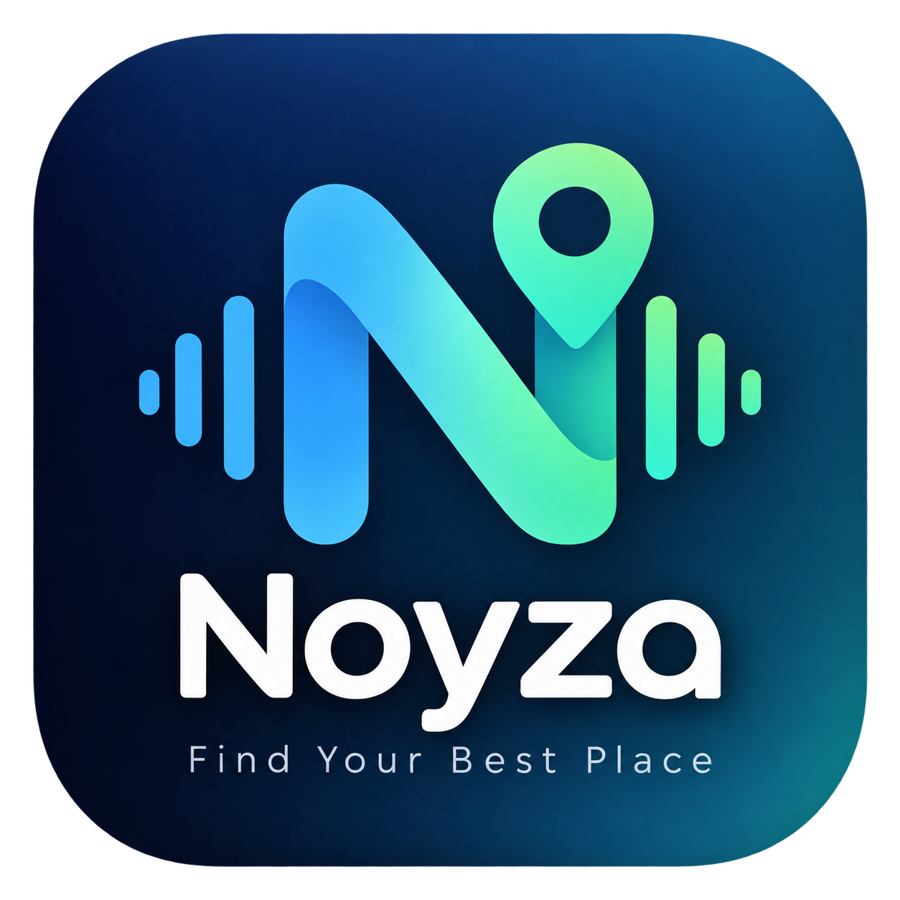
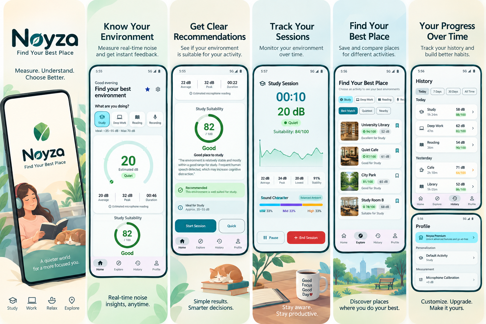

# Noyza — Smart Environment & Noise Suitability Assistant

<p align="center">
  
</p>

<p align="center">
  <strong>Find the right place for what you need to do.</strong>
</p>

<p align="center">
  
  
  
  
  
  
  
</p>

---

## Overview

**Noyza** is a modern, intelligent environment and noise suitability Android application developed by **Khatib Studio**. 

Unlike conventional scientific decibel meters that only output cold decibel numbers, Noyza is built around a practical, user-centric question:

> **“Is this a good place for what I want to do?”**

Noyza measures surrounding ambient sound using the device microphone in real-time, smooths variations, and evaluates acoustic suitability against 10 distinct activity profiles. It provides an intuitive **0–100 suitability score**, environment classifications, historical session tracking, ranked place comparisons, and actionable recommendations.
<p align="center">
  
</p>
---

## Key Features

### 1. Real-Time Noise Measurement & Smart Gauge
- **Acoustic Pipeline:** Real-time PCM audio capture using `AudioRecord` $\rightarrow$ Root Mean Square (RMS) calculation $\rightarrow$ estimated decibel (dB) output.
- **Exponential Smoothing:** Exponential moving average algorithm ($\alpha = 0.15$) for responsive, flutter-free gauge animation.
- **Dynamic Circular Gauge:** Smooth Canvas-drawn circular gauge with responsive gradient arcs reflecting the live sound environment.

### 2. Frequency-Aware Audio Analysis & Psychoacoustics
- **Pure-Kotlin 1024-point Radix-2 FFT:** In-memory spectral decomposition splitting audio into Low (20–250 Hz), Mid (250–4000 Hz), and High (4000–12000 Hz) bands with Hanning windowing.
- **Sound Character Classification:** Automatically categorizes the acoustic fingerprint into *Balanced Ambient*, *Speech & Voices*, *HVAC & Low Hum*, or *Sharp Clatter*.
- **Cognitive Disruption Weighting:** Intelligently penalizes intelligible human speech for focus and study activities, while providing masking credit for steady low-frequency background hum.
- **Live 3-Band Spectral Bar:** Visual real-time frequency distribution bar with character badges in quick measure and active session screens.

### 3. Activity-Based Suitability Engine & Custom Profiles
Noyza calculates environment suitability through a multi-factor weighted psychoacoustic heuristic:
* **40% Noise Amplitude Suitability:** Closeness to ideal dB range for the chosen activity.
* **25% Noise Stability:** Standard deviation and variance penalty for fluctuating environments.
* **20% Peak Noise Behavior:** Impact of sudden loud spikes.
* **15% Sustained Exposure:** Duration spent in loud or very loud thresholds.
* **Spectral Bias Adjustment:** Psychoacoustic cognitive penalty/bonus based on frequency profile.

#### 10 Built-In Activity Profiles & Unlimited Custom Activities
| Activity | Icon | Ideal Range | Acceptable Max | Description |
|---|:---:|:---:|:---:|---|
| **Study** | School | 35 – 55 dB | 70 dB | Focused academic study and exam prep |
| **Deep Work** | Laptop | 30 – 50 dB | 65 dB | High-focus professional tasks and coding |
| **Reading** | MenuBook | 35 – 55 dB | 65 dB | Casual or intensive reading |
| **Recording** | Mic | 20 – 40 dB | 50 dB | Podcasts, vocal audio, and video recording |
| **Meeting** | Groups | 45 – 65 dB | 75 dB | Online calls and conference meetings |
| **Sleep** | Bedtime | 20 – 40 dB | 50 dB | Rest, naps, and night sleep |
| **Relax** | SelfImprovement | 30 – 55 dB | 65 dB | Downtime, meditation, and calm rest |
| **Focus** | Headphones | 35 – 55 dB | 68 dB | General concentration and creative work |
| **Conversation** | Forum | 50 – 70 dB | 80 dB | Casual conversations and coffee chats |
| **Exercise** | FitnessCenter | 55 – 80 dB | 90 dB | Workouts and physical fitness |

- **Custom Activity Creator:** Create tailored activity profiles with customizable Ideal Min/Max dB, Acceptable Max dB, Spike Sensitivity, and Material icons—stored directly in Room DB.

### 4. Predictive Noise Forecasting ("Best Time to Visit")
- **Bayesian Diurnal Model:** Blends empirical historical measurements with a diurnal urban baseline prior across 24 hourly slots.
- **Best Time to Visit Card:** Shows the location's quietest window (e.g. *9:00 AM – 11:30 AM*), peak distraction hours, and a full 24-hour visual noise heat chart.
- **Cross-Screen Integration:** Available on both individual Place Detail screens and the Weekly Analytics dashboard.

### 5. Location Tagging & GPS Proximity
- **GPS Coordinates Storage:** One-tap GPS tagging when saving places with instant latitude and longitude capture.
- **Distance Calculation:** Haversine distance computation displaying real-time proximity badges (*450 m*, *1.8 km*).
- **Nearby Sorting:** Instant sorting of saved study and focus spots by distance.

### 6. Guided Microphone Calibration & Baseline Setup
- **Hardware Variance Compensation:** Accounts for manufacturer microphone gain differences (Samsung, Pixel, Xiaomi, etc.).
- **3-Second Ambient Room Check:** Interactive live baseline test with animated pulse meter and real-time progress bar.
- **Quick Baseline Presets:** One-tap calibration (*Quiet Library ~35 dB*, *Normal Room ~45 dB*, *Active Space ~55 dB*, *Standard 0 dB*) with fine-tuning slider ($-10\text{ dB}$ to $+10\text{ dB}$).

### 7. Accessibility & Sensory-Friendly Mode
- **Haptic Spike Alerts:** Discrete vibration feedback on sudden noise spikes for deaf, hard-of-hearing, or neurodivergent users.
- **Sensory-Friendly Mode:** High-contrast, gentle visual options reducing sensory fatigue.
- **TalkBack Semantics:** Complete semantic descriptions for gauges, frequency bars, and calibration controls.

### 8. Quick Measure & Active Session Tracking
- **Quick Measure:** 10–30 second rapid assessment bottom sheet with instant recommendation.
- **Active Session Mode:** Full-screen measurement with foreground service (`MeasurementService`), live cubic-bezier Canvas noise graph, orange spike detection markers, and 65 dB reference line.
- **High-Noise Alerts:** Real-time push notifications when noise exceeds the acceptable threshold for 3+ minutes.
- **Session Summary:** Comprehensive post-measurement report with average/peak/minimum dB, stability score, percentage distribution breakdown (*Quiet*, *Moderate*, *Loud*, *Very Loud*), and one-tap **Save Place** dialog.

### 9. Saved Places, History & Analytics
- **Explore Screen:** Ranked list of saved places with #1, #2, #3 badges and filters (*Best Overall*, *Quietest*, *Most Stable*, *Nearby*, *Category*).
- **Place Detail & Compatibility Matrix:** Visual acoustic compatibility matrix rating the location across all activities simultaneously.
- **Place Comparison:** Side-by-side comparison of multiple saved spots to decide the optimal working or resting location.
- **7-Day Analytics:** Weekly average dB, environment suitability scores, best day vs. noisiest day, and predictive quiet hours.
- **Data Privacy & Export:** Instant CSV export of all recorded session data via Android `FileProvider` and one-tap total data wipe.

### 10. Monetization & Premium Architecture
- **AdMob Integration:** Centralized `AdManager` with banner, interstitial, and native ad support. Zero ads during active measurement.
- **Google Play Billing 7.x:** Fully scaffolded `BillingManager` supporting subscriptions and lifetime unlock.

---

## Privacy Guarantee

> **Privacy Notice:** Noyza does **NOT** record, store, transcribe, or transmit raw audio data. Audio captured by `AudioRecord` is converted in-memory into numerical RMS values and immediately discarded. Only the computed decibel numbers and statistical summaries are stored locally in the private Room database.

---

## Architecture & Technology Stack

```
com.khatibstudio.noyza
├── ads/                  # AdMob management & lifecycle handling
├── audio/                # AudioRecord capture, RMS math & smoothing
├── billing/              # Google Play Billing 7.x client
├── data/
│   ├── local/            # Room Database, DAOs, Entities, Converters
│   ├── preferences/      # Jetpack DataStore Preferences
│   └── repository/       # PlaceRepository, SessionRepository
├── di/                   # Hilt Dependency Injection modules
├── domain/
│   ├── engine/           # SuitabilityEngine & heuristic scoring
│   └── model/            # ActivityType, SuitabilityResult, Models
├── notification/         # NotificationManager & alert channels
├── receiver/             # Boot receiver for notification scheduling
├── service/              # MeasurementService foreground service
├── ui/
│   ├── components/       # Gauges, Cards, Chips, Sheets, AdSlots
│   ├── navigation/       # Navigation graph & route definitions
│   ├── screens/          # Home, Session, Explore, History, Analytics, Profile, Paywall
│   ├── theme/            # Material 3 Color, Theme, Typography
│   └── viewmodel/        # Architecture ViewModels
└── widget/               # Jetpack Glance Widget & Receiver
```

### Dependencies & Libraries
- **Language:** Kotlin 2.0.21
- **UI Framework:** Jetpack Compose BOM 2024.09.03, Material 3 1.3.x
- **Dependency Injection:** Dagger Hilt 2.51.1
- **Database:** Room 2.6.1 with KSP
- **DataStore:** AndroidX DataStore Preferences 1.1.1
- **Concurrency:** Kotlin Coroutines & Flows
- **Monetization:** Google Mobile Ads (AdMob) SDK 23.4.0 & Google Play Billing 7.1.1
- **Widget:** AndroidX Glance AppWidget 1.1.0 (Material 3)
- **Background Work:** AndroidX WorkManager 2.9.1 & Foreground Services

---

## Build & Setup Instructions

### Prerequisites
1. **Android Studio** Ladybug (2024.2+) or newer.
2. **JDK 17** configured in your development environment.
3. **Android SDK** with API 35 build tools installed.

### Clone and Compile
```bash
# Clone repository
git clone https://github.com/AbrarBb/Noyza.git
cd Noyza

# Run Unit Tests
./gradlew testDebugUnitTest

# Assemble Debug APK
./gradlew assembleDebug
```
The compiled APK will be generated at:
```
app/build/outputs/apk/debug/app-debug.apk
```

---

## Quality Assurance & Testing Suite

A complete QA specification containing test cases across all 14 architectural categories (audio capture, FFT psychoacoustics, suitability engine, custom activity profiles, active session, GPS/places, forecasting, history, widget, monetization, onboarding, accessibility, privacy, and cross-cutting regression) is maintained in:

👉 **[QA Test Case Suite](QA_TEST_SUITE.md)**

---

## Lessons Applied from Cyvia
- **Global Edge-to-Edge:** Configured via `enableEdgeToEdge()` in `MainActivity` with dynamic window insets.
- **Dynamic Navigation Chrome:** Bottom navigation bar automatically hides on sub-screens to maximize screen real estate.
- **Strict ProGuard Rules:** Rules for Room, Gson, and Google Play Billing pre-configured in `proguard-rules.pro`.
- **Ad Frequency Capping & Non-Intrusion:** Ads never interfere with audio measurement or live circular gauges.

---

## License & Attribution

Developed by **Abrar Khatib Lajim** ([Khatib Studio](https://github.com/AbrarBb)).

*Disclaimer: Smartphone microphones are not calibrated sound meters. Decibel values and environmental suitability scores are algorithmic estimates designed for everyday convenience, not professional or medical acoustic certifications.*
